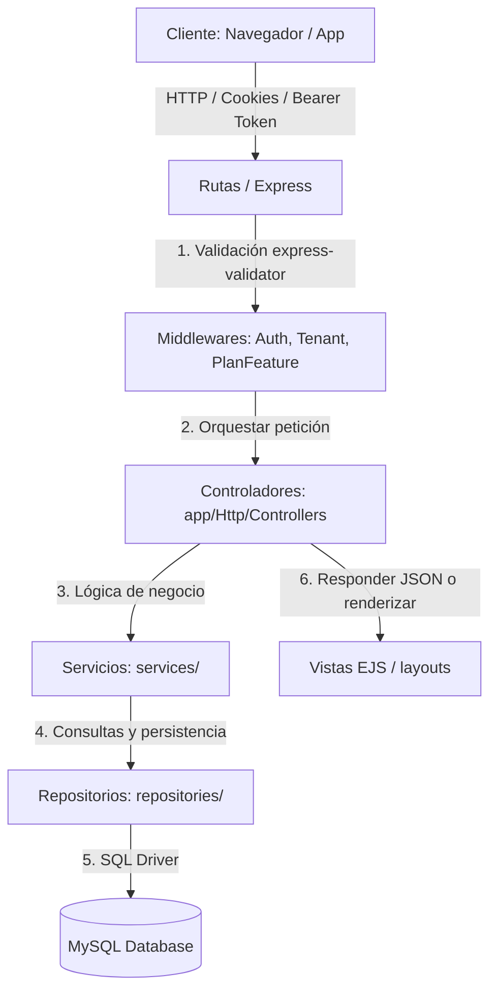

# 📖 Documentación General del Sistema: GastroFlow

GastroFlow es una plataforma web integral de tipo **SaaS (Software as a Service) Multi-tenant** diseñada para la gestión comercial, operativa y administrativa de restaurantes, cafeterías, reposterías y cadenas de comida rápida.

El sistema permite operar múltiples locales o sucursales de forma completamente aislada en una misma base de datos, estructurando el control desde dos planos de acceso: **Superadmin** (administración global de la plataforma, planes y locales) y **Tenant** (operación del día a día de cada restaurante).

---

## 🛠️ 1. Especificación Técnica y Stack Tecnológico

El proyecto está diseñado bajo un ecosistema moderno basado en JavaScript/Node.js, priorizando la velocidad en local (LAN) y compatibilidad para despliegues eficientes en la nube.

| Capa / Componente | Tecnología Utilizada | Observaciones / Rol en el Sistema |
| :--- | :--- | :--- |
| **Entorno de Ejecución** | Node.js (v18 recomendado) | Motor principal del backend. |
| **Framework Web** | Express v4.18.2 | Enrutador y middleware de peticiones. |
| **Base de Datos** | MySQL v5.7 o superior | Almacenamiento relacional rápido (driver `mysql2` con pool de conexiones). |
| **Motor de Vistas** | EJS v3.1.9 (Embedded JavaScript templates) | Motor de renderizado de HTML en el servidor (SSR). |
| **Estilos & Diseño** | Bootstrap v5.3.2 + Vanilla CSS | Maquetación limpia, moderna y responsiva. |
| **Interactividad Frontend**| Vanilla JS + jQuery v3.6.0 | Control dinámico del DOM y peticiones AJAX. |
| **Alertas & Modales** | SweetAlert2 v11 | Reemplazo de diálogos nativos del navegador por modales premium. |
| **Autenticación** | JWT (jsonwebtoken) & cookies | Manejo de sesión persistente mediante cookie `auth_token` y cabeceras Bearer. |
| **Generación de PDFs** | Puppeteer v24 | Generación y maquetación de reportes de cierre mensual. |
| **Exportación/Importación**| ExcelJS v3.4.0 | Carga masiva de productos y descarga de reportes de ventas a Excel. |
| **Integración Telefónica** | whatsapp-web.js v1.34.6 | Bot de WhatsApp integrado que automatiza el envío de recibos. |
| **Pruebas Automatizadas** | Jest (Unitarias) & Playwright (E2E) | Cobertura de calidad en lógica y flujos visuales. |

---

## 🏗️ 2. Arquitectura del Software

GastroFlow implementa un patrón clásico de **Arquitectura por Capas** inspirado en Laravel pero adaptado a Express.js, asegurando la separación estricta de responsabilidades (SRP - Single Responsibility Principle):



### Detalle de las Capas:
1. **Rutas e Inyección (`routes/`)**: Define los endpoints y las páginas expuestas. Mantiene la lógica del enrutamiento limpia de validaciones o queries.
2. **Validación y Middleware (`middleware/`, `app/Http/Requests/`)**: Verifica sesiones (`auth.js`), restringe según el plan/licencia del restaurante (`planFeature.js`), e inyecta la sucursal activa (`tenant.js`).
3. **Controladores (`app/Http/Controllers/`)**:
   - Reciben las peticiones del enrutador.
   - Orquestan llamadas a la capa de servicios.
   - Envían respuestas en JSON o ejecutan el renderizado de plantillas EJS (`res.render`).
4. **Servicios (`services/`)**:
   - Capa donde reside el core de la lógica del negocio (ej. cómo calcular el costo de un plato, cómo descontar stock por receta, etc.).
   - Son completamente independientes del protocolo de red HTTP o el motor de vistas.
5. **Repositorios (`repositories/`)**:
   - Encapsulan las consultas SQL directas a la base de datos MySQL mediante promesas (`mysql2`).
   - Evitan mezclar código de lógica empresarial con consultas de base de datos.
6. **Configuración de Base de Datos (`config/database.js`)**:
   - Inicializa el Pool de conexiones a MySQL.
   - Detecta de forma unificada si la conexión se realiza por URL de producción (`MYSQL_URL`, `DATABASE_URL`) o por variables individuales (`DB_HOST`, `DB_USER`, `DB_PASSWORD`, `DB_NAME`).

---

## 🏢 3. Arquitectura Multi-tenant

GastroFlow almacena los datos de todos los restaurantes de manera conjunta, pero implementa **aislamiento a nivel lógico de datos** mediante la columna `tenant_id` en las tablas clave (productos, clientes, facturas, configuración, mesas, etc.).

### Middleware `attachTenantContext` (`middleware/tenant.js`):
1. **Resolución**: Al iniciar sesión y validar el JWT, el middleware extrae el `tenant_id` asociado al usuario.
2. **Aislamiento**:
   - Inyecta el objeto del restaurante en la petición (`req.tenant`) y en las variables globales de las vistas (`res.locals.tenant`).
   - Si no hay un `tenant_id` (usuario antiguo o legado), asigna la sucursal predeterminada configurada en la BD (`TenantRepository.getDefault()`).
   - Si el restaurante está desactivado por falta de pago o decisión del superadmin, el middleware limpia la cookie de sesión y redirige al login mostrando un mensaje descriptivo.
3. **Acceso Especial (Superadmin)**: El middleware `costeoTenantContext` permite que un Superadmin visualice o modifique el módulo de costeo de cualquier restaurante pasando un parámetro de query (ej. `?tenant_id=3`).

---

## 🔒 4. Seguridad, Roles y Permisos

GastroFlow cuenta con un robusto sistema híbrido de autorización basado en **Planes de Suscripción**, **Roles del Local** y **Permisos Individuales**.

```
                           ┌───────────────────────────┐
                           │      Superadministrador   │ (Acceso total, gestiona la plataforma)
                           └─────────────┬─────────────┘
                                         │
                 ┌───────────────────────┴───────────────────────┐
                 ▼                                               ▼
     ┌───────────────────────┐                       ┌───────────────────────┐
     │  Plan de Suscripción  │                       │    Roles del Local    │
     │  (Límite de Módulos)  │                       │ (Waiter, Chef, Cashier)│
     └───────────┬───────────┘                       └───────────┬───────────┘
                 │                                               │
                 └───────────────────────┬───────────────────────┘
                                         ▼
                             ┌───────────────────────┐
                             │ Permiso de Usuario    │ (Control granular de vistas/APIs)
                             │ (Habilitado / Override)│
                             └───────────────────────┘
```

### Planes de Suscripción
Cada restaurante tiene un plan asignado (`tenant.plan_id`). Los módulos habilitados están controlados por el array de características en la base de datos:
* **Básico:** Dashboard, Productos (catálogo), Clientes, Mesas, Cocina y Ventas (POS estándar).
* **Pro:** Módulos del plan Básico + Costeo, Recetas e Importación/Exportación masiva desde Excel.
* **Premium / Definitivo:** Módulos de Pro + Analítica Avanzada, Predicción de ventas e integración con WhatsApp Bot.

### Roles Predefinidos del Local
Al autenticarse, el usuario hereda permisos globales por su rol asignado:
* **Admin (Administrador):** Acceso y control absoluto del local, gestión de personal, inventarios e informes.
* **Mesero (Waiter):** Visualización de productos, registro de clientes, gestión de mesas/pedidos y creación de facturas preliminares.
* **Cocinero (Chef):** Visualización de productos y control de la cola de preparación en cocina.
* **Cajero (Cashier):** Facturación rápida POS, historial de facturas, control de caja y exportación de ventas.

### Permisos Granulares y Anulaciones (Override)
* El sistema permite añadir **permisos extra a un usuario** específico (`user_permisos`) desde el panel de Superadministrador.
* El middleware `requirePlanFeature` evalúa si el restaurante cuenta con la característica contratada en su plan **O** si el usuario tiene un permiso específico que lo desbloquea directamente (lo que permite dar características Premium a clientes de planes inferiores).

---

## 📦 5. Módulos y Lógica de Negocio

### 1. POS y Ventas rápidas
Ubicado en `/pos`, permite realizar facturación directa sin asignar mesa. Incorpora:
* Registro rápido de productos al carrito.
* Selección de formas de pago (efectivo y transferencia bancaria).
* Asociación inmediata a un cliente registrado para control de fidelización.
* Impresión configurable con anchos de papel térmico personalizados (58mm, 80mm).

### 2. Control de Mesas y Comandas
Permite la visualización de la sala en tiempo real.
* **Ciclo de vida:** Mesa Libre ➔ Mesa Ocupada ➔ En preparación ➔ Listo para servir ➔ Cuenta solicitada.
* Permite agregar items a una mesa abierta, transferir consumos entre mesas y facturar de forma conjunta.

### 3. Cola de Cocina
Optimizado para dispositivos tipo tablet instalados en cocina.
* Muestra las comandas en orden cronológico.
* Permite actualizar estados de preparación (Enviado, Preparando, Listo, Servido).
* Emite notificaciones visuales inmediatas.

### 4. Recetas, Inventario y Costeo
* **Insumos:** Catálogo de materias primas y unidades de medida (KG, Libra, Unidades).
* **Recetas:** Fórmulas de platos. Al vender un producto final, el sistema descuenta de forma automática la cantidad correspondiente de cada insumo utilizado.
* **Costeo:** Compara los costos acumulados de los insumos y mano de obra con el precio de venta sugerido, alertando sobre platos con márgenes de ganancia críticos.

### 5. Bot de WhatsApp Web
* Utiliza una sesión local de navegador para emular un dispositivo móvil conectado.
* Envía al cliente el recibo digital de su compra o la factura en formato PDF de manera automática.

### 6. Analítica y Predicciones de Ventas
* Genera métricas financieras de ventas mensuales.
* Incluye un modelo de predicción básico que analiza tendencias de los últimos meses para proyectar la demanda del mes siguiente.

---

## ⚙️ 6. Motor de Migraciones de Base de Datos

GastroFlow cuenta con un sistema de migraciones personalizado escrito en Node.js (`scripts/run-migrations.js`):

1. **Tabla de Control**: Al iniciar, verifica la existencia de la tabla `schema_migrations`.
2. **Secuencia**:
   - Ejecuta primero el script inicial completo `database.sql`.
   - Busca archivos en `database/migrations/*.sql` y los ordena alfabéticamente para ejecutarlos en secuencia.
3. **Seguridad frente a Fallos**: Si un comando falla porque la columna o tabla ya existe, el motor atrapa y omite los errores predefinidos (`IGNORABLE_ERRORS`), permitiendo que el despliegue continúe sin corromper la BD.

---

## 🚚 7. Despliegue y Operaciones

### Requisitos del Sistema
* Node.js v18 o superior.
* Servidor MySQL v5.7+.

### Configuración del Entorno (`.env`)
```env
PORT=3000
DB_HOST=localhost
DB_USER=root
DB_PASSWORD=tu_password
DB_NAME=restaurante
JWT_SECRET=tu_clave_secreta_jwt
JWT_EXPIRES_IN=24h

# Datos del Administrador y Superadmin Inicial (Se crean al arrancar si no existen)
SUPERADMIN_USERNAME=superadmin
SUPERADMIN_PASSWORD=superadmin123
SUPERADMIN_EMAIL=superadmin@gastroflow.com
SUPERADMIN_NOMBRE="GastroFlow SuperAdmin"

ADMIN_USERNAME=admin
ADMIN_PASSWORD=admin123
ADMIN_EMAIL=admin@gastroflow.com
ADMIN_NOMBRE="Administrador General"
```

### Comandos de Ejecución (Scripts npm)
* `npm start`: Ejecuta las migraciones pendientes, siembra la base de datos de administración y arranca el servidor Express.
* `npm run dev`: Inicializa el servidor mediante `nodemon` para desarrollo rápido.
* `npm run migrate`: Ejecuta manualmente los scripts SQL pendientes en `database/migrations/`.
* `npm run create-test-users`: Crea los usuarios preestablecidos de pruebas (`mesero`, `cocinero`, `cajero`).
* `npm run seed-tenants`: Ejecuta seeders de prueba para poblar el sistema multi-tenant.
* `npm run build`: Genera un ejecutable binario autocontenido para Windows (`dist/gastroflow.exe`) utilizando la librería `pkg`.

### Despliegue en Plataformas en la Nube (ej. Railway / Render)
* GastroFlow no es apto para entornos Serverless (como Vercel) debido al uso de sockets persistentes, el bot de WhatsApp Web y almacenamiento temporal en disco.
* **Railway** es la plataforma recomendada, ya que permite ejecutar el servidor Express de forma continua junto a una base de datos MySQL gestionada. Se recomienda conectar un bucket S3 compatible (`R2StorageService.js`) en producción para almacenar los logotipos y archivos multimedia de los restaurantes.
