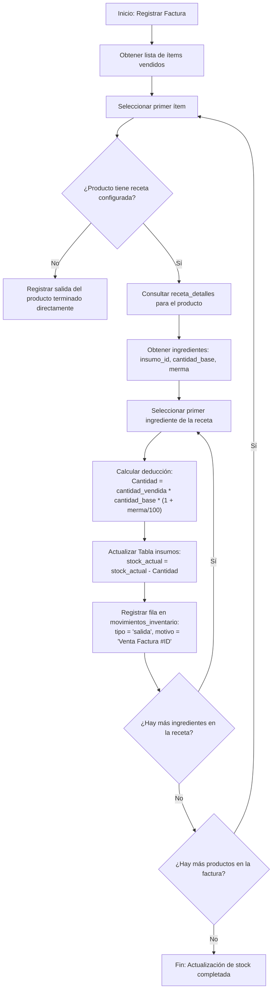
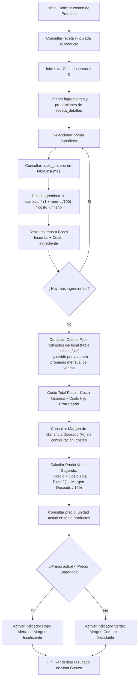

# 📈 Diagramas de Flujo Algorítmicos

Este documento desglosa a nivel algorítmico y de flujo lógico los tres procesos más importantes del sistema GastroFlow: el descuento de stock automático, el costeo e ingeniería de menú, y el middleware de resolución multi-tenant.

---

## 1. Algoritmo de Deducción Automática de Stock (Recetas en Cascada)

Este algoritmo se dispara al momento de registrarse una factura de venta (POS o mesa). Busca restar del inventario los insumos exactos requeridos, contemplando porcentajes de merma o desperdicio.



---

## 2. Algoritmo de Costeo de Platos e Ingeniería de Menú

Determina el costo real de preparación de un plato y alerta si el precio de venta actual genera pérdidas o márgenes inferiores a los objetivos comerciales definidos por el restaurante.



---

## 3. Middleware de Contexto Multi-Tenant (`attachTenantContext`)

Garantiza que ningún usuario de un restaurante pueda consultar, modificar o eliminar datos pertenecientes a otro restaurante. Actúa como el cortafuegos lógico primario en la capa HTTP.

```mermaid
flowchart TD
    A[Llegada de Petición HTTP] --> B{¿Es ruta global / Superadmin?}
    
    B -- Sí --> C[Saltar resolución tenant ➔ Validar rol Superadmin]
    B -- No --> D["Obtener identificador del tenant
    (desde subdominio, ruta, cabecera o cookie de sesión)"]
    
    D --> E{¿Identificador encontrado?}
    E -- No --> F[Retornar Error 400: Local no especificado]
    
    E -- Sí --> G["Consultar tabla tenants donde slug = identificador"]
    G --> H{¿Existe el tenant en BD?}
    
    H -- No --> I[Retornar Error 404: Restaurante no registrado]
    H -- Sí --> J{¿tenant.activo == true?}
    
    J -- No --> K[Retornar Error 403: Suscripción Suspendida]
    J -- Sí --> L["Inyectar contexto en objeto de solicitud:
    req.tenant = tenant_db"]
    
    L --> M["Modificar consultas SQL subsiguientes:
    Agregar cláusula WHERE tenant_id = req.tenant.id"]
    
    M --> N[Pasar control al Controlador (next)]
```
