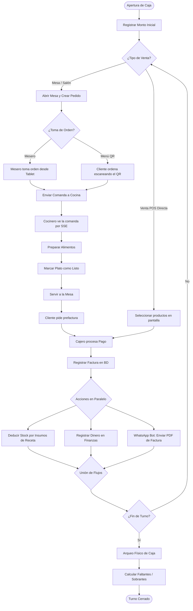

# 🔄 Diagrama de Actividad Completo

Este documento describe la secuencia lógica de actividades operativas y administrativas de GastroFlow, abarcando desde la preparación de la caja hasta la facturación final y auditoría del inventario.

---

## 1. Diagrama de Actividad Operativa (UML / Mermaid)

El siguiente diagrama detalla los hilos de ejecución paralelos y secuenciales de Caja, Salón/Mesas, Cocina e Inventario.

---

## 2. Descripción de Puntos de Control y Bifurcación

### A. Bifurcación de Tipo de Venta
El cajero u operador decide si la transacción se maneja como comanda de mesa (salón) o venta directa (POS). La venta de salón habilita estados en cocina y servicio en mesas; la venta POS procesa el pago inmediatamente, optimizando tiempos de fila.

### B. Notificaciones de Cocina (SSE)
Cuando se envía una comanda a cocina, el backend no obliga a recargar la página. Usa conexiones abiertas mediante **Server-Sent Events (SSE)**. Si la conexión falla, se utiliza un fallback de sondeo corto (short polling) para garantizar la consistencia en el estado de la cola táctil.

### C. Post-procesamiento Asíncrono de Facturas
Al cerrar un pago con éxito, se ejecutan de manera inmediata tres subprocesos:
1. **Deducción de Stock:** Se consulta la ficha técnica del producto. Si posee ingredientes asociados, se restan las cantidades correspondientes a cada insumo en base al factor de desperdicio configurado.
2. **Registro de Flujo de Caja:** Se suma el valor al arqueo total teórico esperado de la caja del turno activo.
3. **Notificación Digital:** El bot de WhatsApp toma el PDF autogenerado de la factura y lo despacha al móvil del cliente.
