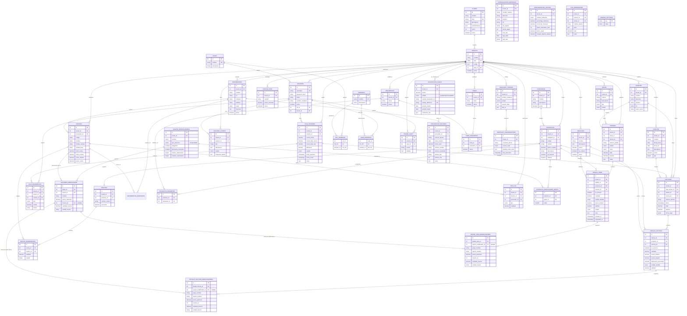

# 📊 Modelo Entidad-Relación (MER / DER) Exhaustivo

Este documento detalla la estructura física de la base de datos de GastroFlow: campos, tipos de datos, llaves primarias/foráneas y relaciones. El esquema real se materializa por 90+ migraciones en `database/migrations/` (última: `090_modificadores_descuenta_inventario.sql`); este MER cubre las tablas principales.

---

## 1. Diagrama Entidad-Relación Completo (Mermaid)

```mermaid
erDiagram
    PLANES ||--o{ TENANTS : "clasifica"
    TENANTS ||--o{ USUARIOS : "pertenece"
    TENANTS ||--o{ PRODUCTOS : "posee"
    TENANTS ||--o{ CLIENTES : "registra"
    TENANTS ||--o{ MESAS : "organiza"
    TENANTS ||--o{ INSUMOS : "almacena"
    TENANTS ||--o{ FACTURAS : "emite"
    TENANTS ||--o{ PEDIDOS : "gestiona"
    TENANTS ||--o{ CAJA_SESIONES : "audita"
    TENANTS ||--o{ EVENTOS : "planifica"
    TENANTS ||--o{ COSTOS_FIJOS : "devenga"
    TENANTS ||--o{ PROVEEDORES : "contrata"
    TENANTS ||--o{ SOPORTE_TICKETS : "abre"
    TENANTS ||--o{ SERVICIOS : "ofrece"
    TENANTS ||--o{ TEMAS : "configura"
    TENANTS ||--o{ PARAMETROS : "establece"
    TENANTS ||--o{ WHATSAPP_CONFIGS : "enlaza"
    
    ROLES ||--o{ USUARIOS : "asigna"
    ROLES ||--o{ ROL_PERMISOS : "agrupa"
    PERMISOS ||--o{ ROL_PERMISOS : "pertenece"
    
    USUARIOS ||--o{ USER_PERMISOS : "override"
    PERMISOS ||--o{ USER_PERMISOS : "sobreescribe"
    USUARIOS ||--o{ CAJA_SESIONES : "abre"
    USUARIOS ||--o{ CAJA_MOVIMIENTOS : "registra"
    USUARIOS ||--o{ SOPORTE_TICKETS : "crea"
    USUARIOS ||--o{ TENANT_AUDIT : "genera"

    CATEGORIAS ||--o{ PRODUCTOS : "clasifica"
    
    CLIENTES ||--o{ FACTURAS : "paga"
    FACTURAS ||--o{ DETALLE_FACTURA : "contiene"
    PRODUCTOS ||--o{ DETALLE_FACTURA : "incluye"
    SERVICIOS ||--o{ DETALLE_FACTURA : "asocia"
    CAJA_SESIONES ||--o{ FACTURAS : "recauda"
    EVENTOS ||--o{ FACTURAS : "vincula"
    
    MESAS ||--o{ PEDIDOS : "aloja"
    CLIENTES ||--o{ PEDIDOS : "solicita"
    PEDIDOS ||--o{ PEDIDO_ITEMS : "contiene"
    PRODUCTOS ||--o{ PEDIDO_ITEMS : "desglosa"
    SERVICIOS ||--o{ PEDIDO_ITEMS : "adiciona"
    
    PRODUCTOS ||--o| RECETAS : "requiere"
    RECETAS ||--o{ RECETA_INGREDIENTES : "contiene"
    INSUMOS ||--o{ RECETA_INGREDIENTES : "emplea"
    
    PROVEEDORES ||--o{ INSUMOS : "provee"
    PROVEEDORES ||--o{ MOVIMIENTOS_INVENTARIO : "registra_en"
    PROVEEDORES ||--o{ PROVEEDOR_FACTURAS : "cobra_en"
    INSUMOS ||--o{ MOVIMIENTOS_INVENTARIO : "fluye_en"
    
    CAJA_SESIONES ||--o{ CAJA_MOVIMIENTOS : "contiene"
    
    TEMAS ||--o{ TEMA_PARAMETRO : "asocia"
    PARAMETROS ||--o{ TEMA_PARAMETRO : "conforma"
    PRODUCTOS ||--o{ PRODUCTO_PARAMETRO : "categoriza"
    PARAMETROS ||--o{ PRODUCTO_PARAMETRO : "clasifica_en"

    %% WHATSAPP_* son tablas LEGADO: la integración se eliminó en 2026-09 (ver módulo 10)
    WHATSAPP_CONFIGS ||--o{ WHATSAPP_CONVERSATIONS : "mantiene"
    TENANTS ||--o{ TENANT_AUDIT : "registra"
    TENANTS ||--o{ MOVI_INV : "descuenta"
    INSUMOS ||--o{ MOVI_INV : "afecta"

    MOVI_INV {
        int id PK
        int tenant_id FK
        int insumo_id FK
        int proveedor_id FK
        enum tipo
        decimal cantidad
    }
    
    TENANTS {
        int id PK
        string nombre
        string slug UK
        json config
        int plan_id FK
        boolean activo
    }
    
    PLANES {
        int id PK
        string nombre
        string slug UK
        string descripcion
        json caracteristicas
        int orden
        boolean activo
    }

    USUARIOS {
        int id PK
        string username UK
        string password_hash
        string email
        string nombre_completo
        boolean activo
        int rol_id FK
        int tenant_id FK
    }

    ROLES {
        int id PK
        string nombre UK
        string descripcion
    }

    PERMISOS {
        int id PK
        string nombre UK
        string descripcion
    }

    ROL_PERMISOS {
        int rol_id PK_FK
        int permiso_id PK_FK
    }

    USER_PERMISOS {
        int user_id PK_FK
        int permiso_id PK_FK
    }

    CATEGORIAS {
        int id PK
        int tenant_id FK
        string nombre
        string descripcion
        boolean activa
    }

    PRODUCTOS {
        int id PK
        int tenant_id FK
        int categoria_id FK
        string codigo
        string nombre
        decimal precio_unidad
        string descripcion
        boolean es_favorito
        boolean deleted
    }

    CLIENTES {
        int id PK
        int tenant_id FK
        string nombre
        string direccion
        string telefono
        string nit
        string razon_social
    }

    FACTURAS {
        int id PK
        int tenant_id FK
        int caja_sesion_id FK
        int cliente_id FK
        int evento_id FK
        string numero_factura
        timestamp fecha
        decimal total
        decimal propina
        enum forma_pago
    }

    DETALLE_FACTURA {
        int id PK
        int factura_id FK
        int producto_id FK
        int servicio_id FK
        boolean es_servicio
        decimal cantidad
        decimal precio_unitario
        decimal precio_original
        decimal descuento_porcentaje
        enum unidad_medida
        decimal subtotal
    }

    CONFIGURACION_IMPRESION {
        int id PK
        int tenant_id FK
        string nombre_negocio
        string direccion
        string telefono
        string nit
        string pie_pagina
        int ancho_papel
        int font_size
        blob logo_data
        string logo_tipo
    }

    MESAS {
        int id PK
        int tenant_id FK
        string numero
        string descripcion
        enum tipo
        enum estado
    }

    PEDIDOS {
        int id PK
        int tenant_id FK
        int mesa_id FK
        int cliente_id FK
        string numero_pedido
        enum estado
        enum canal
        decimal total
        decimal propina
        text notas
    }

    PEDIDO_ITEMS {
        int id PK
        int tenant_id FK
        int pedido_id FK
        int producto_id FK
        int servicio_id FK
        boolean es_servicio
        decimal cantidad
        enum unidad_medida
        decimal precio_unitario
        decimal subtotal
        enum estado
        text nota
        timestamp enviado_at
        timestamp preparado_at
    }

    TENANT_AUDIT {
        int id PK
        int tenant_id FK
        int user_id FK
        string accion
        text detalles
    }

    INSUMOS {
        int id PK
        int tenant_id FK
        int proveedor_id FK
        string codigo
        string nombre
        string unidad_compra
        string unidad_base
        decimal stock_actual
        decimal stock_minimo
        decimal costo_unitario
        decimal precio_venta
    }

    RECETAS {
        int id PK
        int tenant_id FK
        int producto_id FK
        string nombre_receta
        decimal porciones
    }

    RECETA_INGREDIENTES {
        int id PK
        int receta_id FK
        int insumo_id FK
        decimal cantidad
        string unidad
    }

    CONFIGURACION_COSTEO {
        int id PK
        int tenant_id FK
        enum metodo_indirectos
        decimal porcentaje_indirectos
        decimal costo_fijo_mensual
        int platos_estimados_mes
        decimal factor_carga
        decimal margen_objetivo_default
    }

    TEMAS {
        int id PK
        int tenant_id FK
        string name
        boolean status
    }

    PARAMETROS {
        int id PK
        int tenant_id FK
        string name
        boolean status
    }

    TEMA_PARAMETRO {
        int id PK
        int tema_id FK
        int parametro_id FK
        boolean status
    }

    PRODUCTO_PARAMETRO {
        int id PK
        int producto_id FK
        int parametro_id FK
    }

    EVENTOS {
        int id PK
        int tenant_id FK
        string nombre
        date fecha_inicio
        date fecha_fin
        text descripcion
        boolean activo
        enum tipo
    }

    COSTOS_FIJOS {
        int id PK
        int tenant_id FK
        string nombre
        decimal monto_mensual
        boolean activo
    }

    WHATSAPP_CONFIGS {
        int id PK
        int tenant_id FK
        string nombre_instancia
        enum estado
        text session_data
        text last_qr
    }

    WHATSAPP_CONVERSATIONS {
        int id PK
        int tenant_id FK
        string customer_phone
        enum current_state
        json pending_order_data
        timestamp last_interaction
    }

    PROVEEDORES {
        int id PK
        int tenant_id FK
        string nombre
        string nit
        string contacto
        string telefono
        string email
        text direccion
        boolean activo
    }

    PROVEEDOR_FACTURAS {
        int id PK
        int tenant_id FK
        int proveedor_id FK
        string numero_factura
        date fecha_emision
        decimal monto_total
        string archivo_nombre
        blob archivo_contenido
        string archivo_tipo
        int archivo_size
        text notas
    }

    CAJA_SESIONES {
        int id PK
        int tenant_id FK
        int usuario_id FK
        decimal monto_inicial
        decimal monto_final_teorico
        decimal monto_final_real
        decimal diferencia
        enum estado
        timestamp fecha_apertura
        timestamp fecha_cierre
        text notas
    }

    CAJA_MOVIMIENTOS {
        int id PK
        int tenant_id FK
        int sesion_id FK
        int usuario_id FK
        enum tipo
        decimal monto
        string motivo
    }

    SERVICIOS {
        int id PK
        int tenant_id FK
        string nombre
        text descripcion
        decimal precio
        boolean es_externo
        boolean activo
    }

    SOPORTE_TICKETS {
        int id PK
        int tenant_id FK
        int usuario_id FK
        string tipo
        text descripcion
        enum estado
        text respuesta_admin
    }

    POS_BORRADORES {
        int id PK
        int tenant_id FK
        int usuario_id FK
        int cliente_id FK
        string nombre_cliente
        json items
        decimal total
        text notas
    }

    LANDING_SETTINGS {
        string key PK
        string value
    }

    %% ---- Modificadores / Toppings (migraciones 077, 090) ----
    PRODUCTOS ||--o{ PRODUCTO_MODIFICADOR_GRUPO : "ofrece"
    GRUPOS_MODIFICADORES ||--o{ PRODUCTO_MODIFICADOR_GRUPO : "asignado_a"
    GRUPOS_MODIFICADORES ||--o{ OPCIONES_MODIFICADOR : "contiene"
    INSUMOS ||--o{ OPCIONES_MODIFICADOR : "descuenta (opt-in)"
    PEDIDO_ITEMS ||--o{ PEDIDO_ITEM_MODIFICADORES : "snapshot"
    DETALLE_FACTURA ||--o{ DETALLE_FACTURA_MODIFICADORES : "snapshot"
    OPCIONES_MODIFICADOR ||--o{ PEDIDO_ITEM_MODIFICADORES : "referencia (SET NULL)"
    OPCIONES_MODIFICADOR ||--o{ DETALLE_FACTURA_MODIFICADORES : "referencia (SET NULL)"

    GRUPOS_MODIFICADORES {
        int id PK
        int tenant_id FK
        string nombre
        enum tipo_seleccion "unica|multiple"
        boolean obligatorio
        boolean descuenta_inventario
        tinyint minimo_selecciones
        tinyint maximo_selecciones
    }
    OPCIONES_MODIFICADOR {
        int id PK
        int grupo_id FK
        int tenant_id FK
        string nombre
        decimal precio_adicional
        int insumo_id FK "nullable"
        decimal cantidad_insumo
        string unidad_insumo
    }
    PRODUCTO_MODIFICADOR_GRUPO {
        int id PK
        int producto_id FK
        int grupo_id FK
        smallint orden
    }
    PEDIDO_ITEM_MODIFICADORES {
        int id PK
        int pedido_item_id FK
        int opcion_modificador_id FK "nullable"
        string grupo_nombre
        string opcion_nombre
        decimal precio_adicional
        int insumo_id
        decimal cantidad_insumo
        string unidad_insumo
    }
    DETALLE_FACTURA_MODIFICADORES {
        int id PK
        int detalle_factura_id FK
        int opcion_modificador_id FK "nullable"
        string grupo_nombre
        string opcion_nombre
        decimal precio_adicional
        int insumo_id
        decimal cantidad_insumo
        string unidad_insumo
    }

    %% ---- Suscripción SaaS / Wompi (migración 084) ----
    TENANTS ||--o{ SUSCRIPCION_PAGOS : "es_cobrado_en"
    SUSCRIPCION_PAGOS {
        int id PK
        int tenant_id FK
        decimal monto
        enum estado "pendiente|exitoso|fallido"
        string wompi_transaction_id
        string wompi_reference UK
        date periodo_desde
        date periodo_hasta
        json respuesta_raw
    }
```

---

## 2. Diccionario Detallado de Tablas y Relaciones

### 1. `planes` (SaaS Global)
* Habilita/deshabilita módulos de forma dinámica en base al plan (`basico`, `pro`, `premium`).
* Relacionado a `tenants` (1 a muchos).

### 2. `tenants` (SaaS Inquilinos)
* Corazón del multi-tenant. Cada local tiene su fila.
* Posee relaciones restrictivas con todos los datos operacionales de salón, POS e inventario.

### 3. `usuarios` / `roles` / `permisos` / `rol_permisos` / `user_permisos` (Seguridad)
* Estructura de control de acceso basada en roles (RBAC) y overrides directos (`user_permisos`) gestionables a nivel individual de usuario.

### 4. `productos` / `categorias` (Menú)
* Inventario de venta comercial. Soporta marcadores de favorito y soft delete (`deleted` = 1) para preservar históricos contables.

### 5. `insumos` / `proveedores` / `proveedor_facturas` / `movimientos_inventario` (Inventarios)
* Catálogo de compras y materias primas. Las compras ingresan por movimientos o se auditan digitalmente adjuntando la factura real (`proveedor_facturas.archivo_contenido` como LONGBLOB).

### 6. `recetas` / `receta_ingredientes` / `configuracion_costeo` / `costos_fijos` (Costos e Ingeniería)
* Lógica de costeo y márgenes. Cruza costos directos (`receta_ingredientes`) e indirectos (`costos_fijos`) para evaluar desvíos de precios comerciales.

### 7. `mesas` / `pedidos` / `pedido_items` / `servicios` (Operación de Salón)
* Control de ocupación y flujo del salón. Soporta servicios externos (como cargos por delivery o montaje) que no afectan volumen de utilidad de cocina.

### 8. `facturas` / `detalle_factura` / `detalle_factura_modificadores` (Facturación)
* Consolidado fiscal. Almacena las ventas ejecutadas en salón o vía POS. `detalle_factura_modificadores` guarda el snapshot de toppings por línea (nombre, precio y, si aplica, insumo/cantidad para el descuento de inventario).

### 9. `caja_sesiones` / `caja_movimientos` (Caja Chica)
* Bitácora financiera diaria por cajero. Relaciona facturas y egresos menores para auditoría de descuadres.

### 10. `grupos_modificadores` / `opciones_modificador` / `producto_modificador_grupo` / `pedido_item_modificadores` (Modificadores / Toppings)
* Grupos de opciones asignables a productos (N:M). `grupos_modificadores.descuenta_inventario` activa el descuento de stock; entonces cada `opciones_modificador` se enlaza a un `insumo_id` + cantidad. Las tablas `*_modificadores` son **snapshots** de la venta (FK a la opción con `ON DELETE SET NULL`). Ver módulo 12.

### 11. `tenants.*wompi*` / `suscripcion_pagos` (Suscripción SaaS)
* Cobro recurrente de la suscripción de cada tenant vía Wompi. `tenants` gana `wompi_payment_source_id`, `proximo_cobro`, `intentos_fallidos_pago`, `suspendido_por_pago`, `ultimo_intento_cobro_at`. `suscripcion_pagos` es el historial de intentos. Ver módulo 13.

### 12. `whatsapp_configs` / `whatsapp_conversations` (Mensajería) — ⚠️ LEGADO
* La integración de WhatsApp fue **eliminada (2026-09)**. Las tablas siguen existiendo pero ningún código las escribe. Ver módulo 10.

### 13. `soporte_tickets` (Soporte Técnico)
* Tickets de soporte abiertos por los usuarios de locales dirigidos a los Superadmins de la plataforma.

### 14. `pos_borradores` (POS Borradores)
* Almacena en formato JSON carritos de compra pausados o aparcados para su posterior reanudación.

### 15. `landing_settings` (CMS de Landing)
* Parámetros estéticos globales (colores HSL), datos de contacto y textos legales de la página web de GastroFlow.

> Tablas no listadas arriba pero presentes en migraciones: `eventos`, `servicios`, `job_queue`, `facturas_electronicas` + config fiscal, `tenant_audit`, `temas` / `parametros` / `tema_parametro` / `producto_parametro`, `sync_*`, entre otras.
