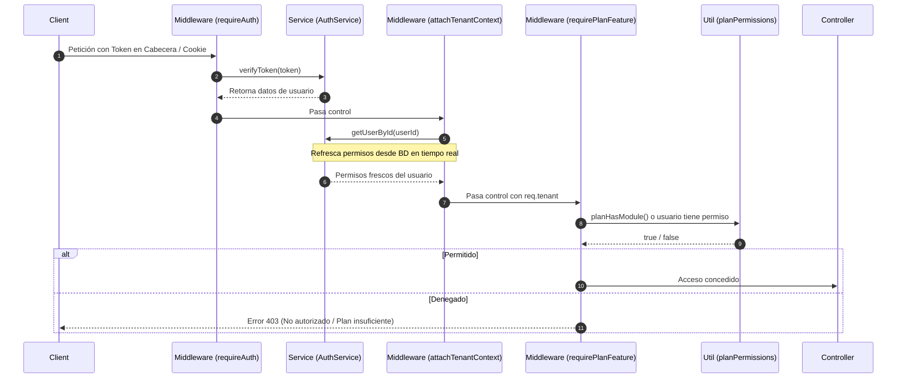

# 🔑 Módulo 1: Autenticación, Seguridad y Autorización

### 1. Descripción Funcional
Maneja el registro de sesiones de los usuarios, validación de credenciales encriptadas, control de acceso basado en JSON Web Tokens (JWT) y el sistema jerárquico de planes de suscripción y permisos por rol o usuario.

---

### 2. Componentes del Código
* **Controlador:** [AuthController.js](file:///c:/laragon/www/Sistema-Restaurante-Node/app/Http/Controllers/AuthController.js)
* **Servicio:** [AuthService.js](file:///c:/laragon/www/Sistema-Restaurante-Node/services/Shared/AuthService.js)
* **Middlewares:**
  * [auth.js](file:///c:/laragon/www/Sistema-Restaurante-Node/middleware/auth.js) (`requireAuth`, `requireRole`, `requirePermission`)
  * [tenant.js](file:///c:/laragon/www/Sistema-Restaurante-Node/middleware/tenant.js) (`attachTenantContext`)
  * [planFeature.js](file:///c:/laragon/www/Sistema-Restaurante-Node/middleware/planFeature.js) (`requirePlanFeature`)
* **Utilidades:** [planPermissions.js](file:///c:/laragon/www/Sistema-Restaurante-Node/utils/planPermissions.js)

---

### 3. Tablas de Base de Datos Relacionadas
* `usuarios`: Datos del usuario (nombre, email, username, contraseña encriptada en bcrypt, rol y su `tenant_id`).
* `roles`: Roles disponibles (`admin`, `mesero`, `cocinero`, `cajero`, `superadmin`).
* `permisos`: Lista global de permisos (ej. `productos.ver`, `costeo.editar`).
* `rol_permisos`: Permisos asignados por defecto a cada rol de restaurante.
* `user_permisos`: Anulaciones o permisos extra específicos de un usuario (administrados por el Superadmin).

---

### 4. Diagrama de Flujo de Autorización (JWT + Rol + Plan)

