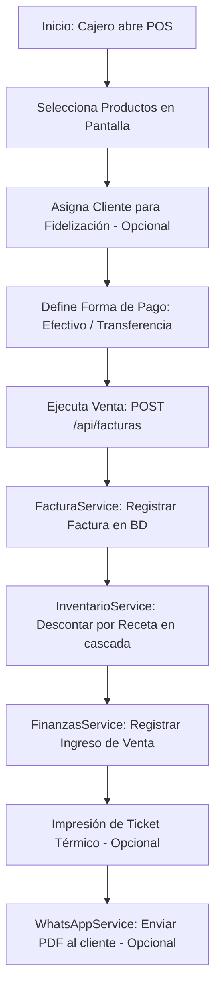

# ⚡ Módulo 2: POS (Punto de Venta / Ventas Rápidas)

### 1. Descripción Funcional
Permite realizar ventas rápidas y directas en el mostrador. Los cajeros seleccionan productos del menú, asignan opcionalmente un cliente y registran el cobro en efectivo o transferencia bancaria de manera instantánea, sin tener que gestionar una mesa física en el salón.

---

### 2. Componentes del Código
* **Controlador:** [POSController.js](file:///c:/laragon/www/Sistema-Restaurante-Node/app/Http/Controllers/Tenant/POSController.js)
* **Servicios:**
  * [POSService.js](file:///c:/laragon/www/Sistema-Restaurante-Node/services/Tenant/POSService.js)
  * [FacturaService.js](file:///c:/laragon/www/Sistema-Restaurante-Node/services/Tenant/FacturaService.js)
* **Repositorio:** [POSRepository.js](file:///c:/laragon/www/Sistema-Restaurante-Node/repositories/Tenant/POSRepository.js)
* **Ruta de Acceso:** `/pos` (interfaz visual) y `/api/facturas` (API de creación)

---

### 3. Tablas de Base de Datos Relacionadas
* `facturas`: Guarda el encabezado de la venta (total facturado, método de pago, cliente, usuario de caja).
* `factura_detalles`: Ítems vendidos con sus cantidades y precios históricos de venta.

---

### 4. Diagrama de Flujo del Proceso POS

