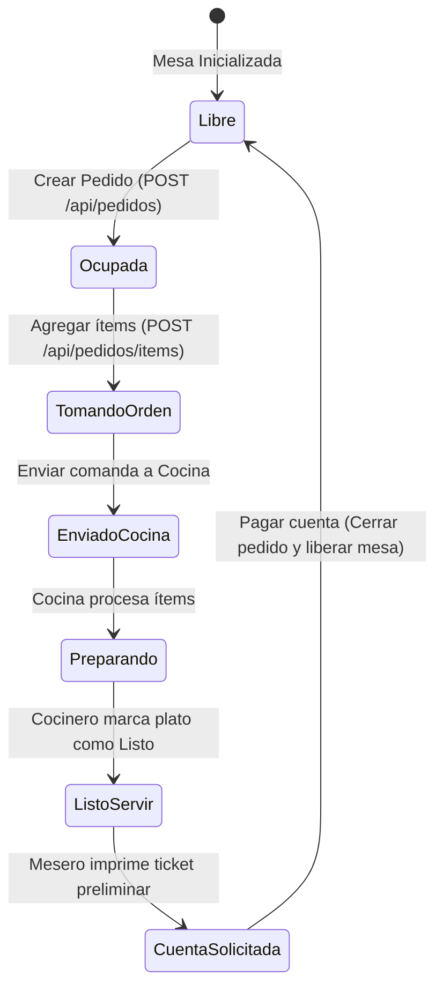

# 🍽️ Módulo 3: Mesas y Pedidos

### 1. Descripción Funcional
Administra la distribución física y el estado de ocupación del salón. Los meseros pueden abrir mesas virtuales, añadir productos solicitados por los clientes en tiempo real, enviar comandas directamente a la cocina, mover consumos entre mesas y realizar cierres parciales de cuentas.

---

### 2. Componentes del Código
* **Controlador:** [MesasController.js](file:///c:/laragon/www/Sistema-Restaurante-Node/app/Http/Controllers/Tenant/Mesas/MesasController.js)
* **Servicio:** [MesaService.js](file:///c:/laragon/www/Sistema-Restaurante-Node/services/Tenant/Mesas/MesaService.js)
* **Repositorio:** [MesaRepository.js](file:///c:/laragon/www/Sistema-Restaurante-Node/repositories/Tenant/MesaRepository.js)
* **Ruta de Acceso:** `/mesas`

---

### 3. Tablas de Base de Datos Relacionadas
* `mesas`: Lista de mesas físicas configuradas por local (número, capacidad, ubicación, estado_actual).
* `pedidos`: Cabecera del pedido (vincular a mesa y usuario, total acumulado, estado: `abierto`, `cerrado`, `cancelado`).
* `pedido_items`: Relación de platos agregados al pedido con cantidades, precios y estados de cocina.

---

### 4. Diagrama de Estado del Pedido y Mesa

