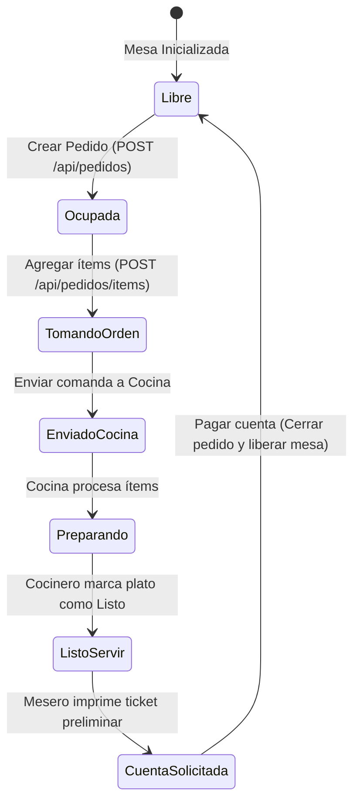

# 🍽️ Módulo 3: Mesas y Pedidos

### 1. Descripción Funcional
Administra la distribución física y el estado de ocupación del salón. Los meseros pueden abrir mesas virtuales, añadir productos solicitados por los clientes en tiempo real, enviar comandas directamente a la cocina, mover consumos entre mesas y realizar cierres parciales de cuentas.

---

### 2. Componentes del Código
* **Controlador:** [MesasController.js](file:///c:/laragon/www/Sistema-Restaurante-Node/app/Http/Controllers/Tenant/Mesas/MesasController.js)
* **Servicio:** [MesaService.js](file:///c:/laragon/www/Sistema-Restaurante-Node/services/Tenant/Mesas/MesaService.js)
* **Repositorio:** [MesaRepository.js](file:///c:/laragon/www/Sistema-Restaurante-Node/repositories/Tenant/MesaRepository.js)
* **Ruta de Acceso:** `/mesas`

---

### 3. Tablas de Base de Datos Relacionadas
* `mesas`: mesas físicas (`qr_token` para el Menú QR) y virtuales (domicilios). Número, capacidad, ubicación, estado.
* `pedidos`: cabecera (mesa, usuario, total, `estado`: `abierto`/`cerrado`/`cancelado`, `origen`: `mesero`/`qr`/`caja`, `propina`).
* `pedido_items`: platos del pedido con cantidad, precio, `estado` de cocina, **`nota` por ítem** y `modificadores_hash`.
* `pedido_item_modificadores`: toppings elegidos por ítem (ver módulo 12). En el carrito de Mesas se muestran los toppings y la nota bajo el nombre del producto.
* Los pedidos creados desde el **Menú QR** (`origen = 'qr'`) aparecen en esta misma pantalla para que el mesero los valide y envíe a cocina.

---

### 4. Diagrama de Estado del Pedido y Mesa

```mermaid
stateDiagram-v2
    [*] --> Libre : Mesa Inicializada
    Libre --> Ocupada : Crear Pedido (POST /api/pedidos)
    Ocupada --> TomandoOrden : Agregar ítems (POST /api/pedidos/items)
    TomandoOrden --> EnviadoCocina : Enviar comanda a Cocina
    EnviadoCocina --> Preparando : Cocina procesa ítems
    Preparando --> ListoServir : Cocinero marca plato como Listo
    ListoServir --> CuentaSolicitada : Mesero imprime ticket preliminar
    CuentaSolicitada --> Libre : Pagar cuenta (Cerrar pedido y liberar mesa)
```
