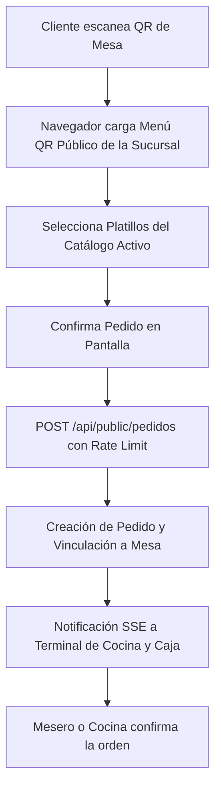

# 📱 Módulo 4: Menú QR Público

### 1. Descripción Funcional
Permite a los comensales sentados a la mesa escanear un código QR con sus dispositivos móviles para visualizar la carta interactiva del local en tiempo real y, opcionalmente, enviar pedidos de forma directa a la cola de preparación sin requerir asistencia inmediata de un mesero.

---

### 2. Componentes del Código
* **Controlador:** [PublicController.js](file:///c:/laragon/www/Sistema-Restaurante-Node/app/Http/Controllers/Public/PublicController.js) (Rutas de acceso público sin autenticación)
* **Middleware de Protección:** Rate limits específicos para evitar spam de pedidos públicos.
* **Ruta de Acceso:** `/qr/:tenant_slug/:mesa_id`

---

### 3. Tablas de Base de Datos Relacionadas
* `mesas`: Para identificar la mesa de origen y su estado actual.
* `productos` e `insumos`: Carga y renderizado dinámico de la carta de alimentos activa.
* `pedidos` y `pedido_items`: Persistencia directa del pedido autogestionado por el cliente.

---

### 4. Diagrama del Flujo QR de Autoconsumo

