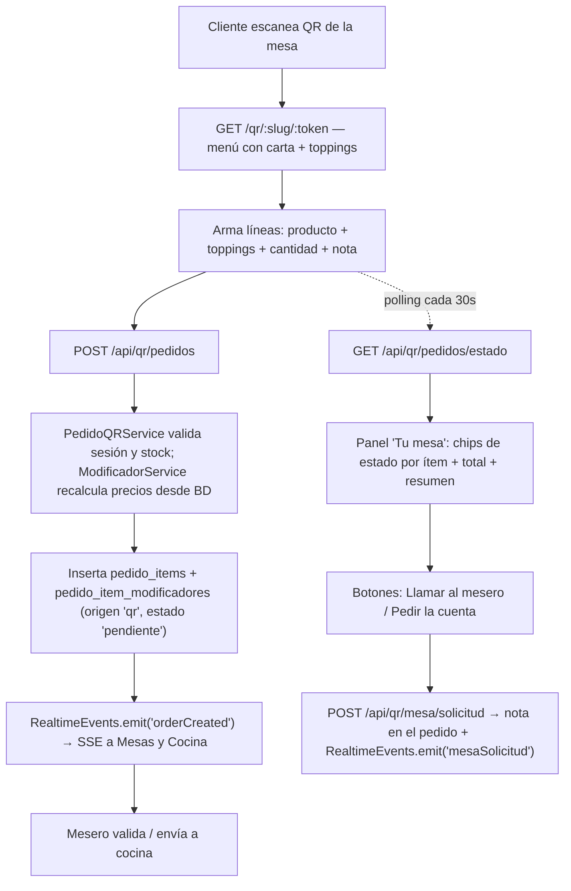

# 📱 Módulo 4: Menú QR Público

### 1. Descripción Funcional
Menú digital de autoconsumo: el comensal escanea el QR de su mesa y ve la carta del local en su móvil. Puede armar un pedido con **toppings/modificadores** y **nota por producto**, enviarlo directo a la mesa, seguir **el estado de cada plato** (recibido → en cocina → preparando → listo → servido), ver el **total acumulado de la mesa** y **llamar al mesero** o **pedir la cuenta**.

Sin autenticación; protegido por rate limits y por una cookie de sesión ligada a la mesa (expira por inactividad).

---

### 2. Componentes del Código
* **Vista del menú:** [MenuQRController.js](file:///c:/laragon/www/Sistema-Restaurante-Node/app/Http/Controllers/Public/MenuQRController.js) → `services/Public/MenuQRService.js` + `repositories/Public/MenuQRRepository.js`
* **Pedidos / estado / solicitudes:** [PedidoQRController.js](file:///c:/laragon/www/Sistema-Restaurante-Node/app/Http/Controllers/Public/PedidoQRController.js) → `services/Public/PedidoQRService.js`
* **Precio y reglas de toppings:** `services/Tenant/ModificadorService.js` (reutilizado; el catálogo en BD es la fuente de verdad del precio).
* **Frontend:** `views/qr/menu.ejs` + `public/js/modulos/menu-qr.js` + `public/css/modulos/menu-qr.css` (carrito por líneas: `producto + toppings + nota`).
* **Rutas:**
  * `GET /qr/:tenantSlug/:qrToken` — render del menú.
  * `POST /api/qr/pedidos` — crear/anexar pedido (rate limit 3 / 10 min por IP).
  * `GET /api/qr/pedidos/estado?qr_token=...` — pedido abierto de la mesa: items, estado de cada línea, resumen y total (polling, límite holgado).
  * `POST /api/qr/mesa/solicitud` `{ qr_token, tipo: 'mesero' | 'cuenta' }` — avisa al personal (rate limit 10 / 10 min).

---

### 3. Tablas de Base de Datos Relacionadas
* `mesas`: identifica la mesa por `qr_token` (tipo `fisica`); `qr_session_id` + `last_qr_activity` para la validez temporal de la sesión.
* `tenants`: `slug`, `config` (colores/tema del menú), estado activo.
* `productos`: solo los que tienen `activo = 1 AND mostrar_en_qr = 1`; `pide_nota` obliga nota por producto.
* `grupos_modificadores` / `opciones_modificador` / `producto_modificador_grupo`: toppings disponibles por producto (ver módulo 12).
* `pedidos` (`origen = 'qr'`, `sesion_cliente`) / `pedido_items` (`nota`, `modificadores_hash`) / `pedido_item_modificadores`.

---

### 4. Diagrama del Flujo QR

```mermaid
graph TD
    A["Cliente escanea QR de la mesa"] --> B["GET /qr/:slug/:token — menú con carta + toppings"]
    B --> C["Arma líneas: producto + toppings + cantidad + nota"]
    C --> D["POST /api/qr/pedidos"]
    D --> E["PedidoQRService valida sesión y stock; ModificadorService recalcula precios desde BD"]
    E --> F["Inserta pedido_items + pedido_item_modificadores (origen 'qr', estado 'pendiente')"]
    F --> G["RealtimeEvents.emit('orderCreated') → SSE a Mesas y Cocina"]
    G --> H["Mesero valida / envía a cocina"]
    C -. "polling cada 30s" .-> I["GET /api/qr/pedidos/estado"]
    I --> J["Panel 'Tu mesa': chips de estado por ítem + total + resumen"]
    J --> K["Botones: Llamar al mesero / Pedir la cuenta"]
    K --> L["POST /api/qr/mesa/solicitud → nota en el pedido + RealtimeEvents.emit('mesaSolicitud')"]
```

---

### 5. Detalles
* **Carrito por líneas:** dos entradas del mismo producto con distintos toppings o distinta nota son líneas separadas (clave `producto|opcionIds|nota`).
* **Seguimiento:** el estado de cada línea sale de `pedido_items.estado`; el chip verde en el header aparece cuando algo está `listo`.
* **Pedido acumulado:** si la mesa ya tiene un pedido abierto, el menú avisa que lo nuevo se suma a esa cuenta.
* **Notificación al personal:** las solicitudes (`mesero`/`cuenta`) dejan traza en `pedidos.notas` y disparan un toast en el panel de Mesas vía SSE (`NotificationController` reenvía el evento `mesaSolicitud`).

### 6. Pendiente (backlog acordado)
Producto agotado (hoy el stock es *soft-warn*), carrito en `localStorage`, propina en el checkout, buscador de productos, etiquetas de alérgenos/dietéticas, `loading="lazy"` en imágenes, permitir zoom, y (opcional) pago en línea reusando Wompi.
