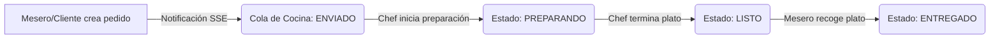

# 🧑‍🍳 Módulo 5: Cola de Cocina

### 1. Descripción Funcional
Una interfaz gráfica en tiempo real optimizada para tablets e instalada en la cocina del restaurante. El personal de cocina puede visualizar las comandas entrantes ordenadas por tiempo de espera y actualizar el estado de preparación de los platos para notificar a los meseros.

---

### 2. Componentes del Código
* **Controlador:** [CocinaController.js](file:///c:/laragon/www/Sistema-Restaurante-Node/app/Http/Controllers/Tenant/CocinaController.js)
* **Servicio:** [CocinaService.js](file:///c:/laragon/www/Sistema-Restaurante-Node/services/Tenant/CocinaService.js)
* **Repositorio:** [CocinaRepository.js](file:///c:/laragon/www/Sistema-Restaurante-Node/repositories/Tenant/CocinaRepository.js)
* **Notificaciones en Vivo:** Server-Sent Events (SSE) en `/api/notificaciones`

---

### 3. Tablas de Base de Datos Relacionadas
* `pedido_items`: Lectura de los estados (`enviado`, `preparando`, `listo`, `entregado`) y notas de preparación añadidas por los meseros.

---

### 4. Diagrama del Flujo de Comandas en Cocina

