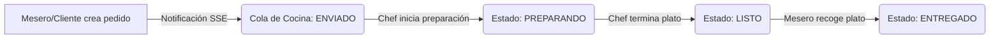

# 🧑‍🍳 Módulo 5: Cola de Cocina

### 1. Descripción Funcional
Una interfaz gráfica en tiempo real optimizada para tablets e instalada en la cocina del restaurante. El personal de cocina puede visualizar las comandas entrantes ordenadas por tiempo de espera y actualizar el estado de preparación de los platos para notificar a los meseros.

---

### 2. Componentes del Código
* **Controlador:** [CocinaController.js](file:///c:/laragon/www/Sistema-Restaurante-Node/app/Http/Controllers/Tenant/CocinaController.js)
* **Servicio:** [CocinaService.js](file:///c:/laragon/www/Sistema-Restaurante-Node/services/Tenant/CocinaService.js)
* **Repositorio:** [CocinaRepository.js](file:///c:/laragon/www/Sistema-Restaurante-Node/repositories/Tenant/CocinaRepository.js)
* **Notificaciones en Vivo:** Server-Sent Events (SSE) en `GET /api/notifications/subscribe`, alimentado por el evento `orderCreated` de `services/Shared/RealtimeEvents.js`.

---

### 3. Tablas de Base de Datos Relacionadas
* `pedido_items`: estados (`pendiente`, `enviado`, `preparando`, `listo`, `servido`, `cancelado`), `nota` por ítem y `modificadores_hash`.
* `pedido_item_modificadores`: toppings de cada ítem; la cola agrupa por `nota` + `modificadores_hash` para no mezclar el mismo producto con distinta personalización.

---

### 4. Diagrama del Flujo de Comandas en Cocina

```mermaid
graph LR
    A[Mesero/Cliente crea pedido] -->|Notificación SSE| B(Cola de Cocina: ENVIADO)
    B -->|Chef inicia preparación| C(Estado: PREPARANDO)
    C -->|Chef termina plato| D(Estado: LISTO)
    D -->|Mesero recoge plato| E(Estado: ENTREGADO)
```
