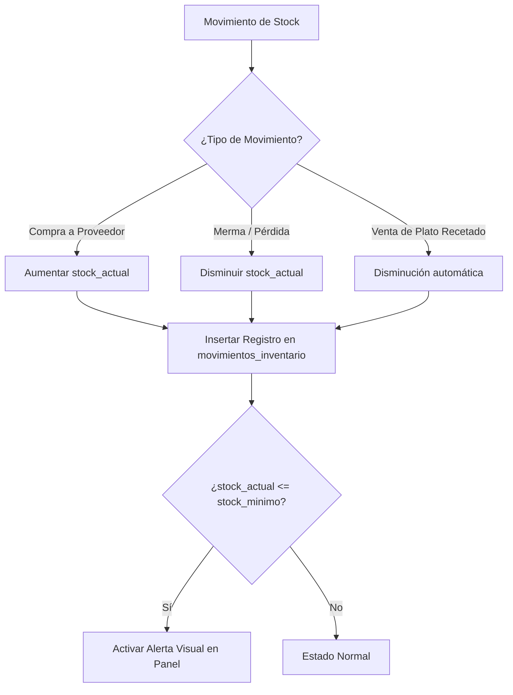

# 📦 Módulo 6: Inventario e Insumos

### 1. Descripción Funcional
Maneja el catálogo físico y digital de materias primas y consumibles (alimentos, bebidas, envases). Controla los niveles de stock físico, umbrales mínimos de alerta y la bitácora detallada de auditoría para ingresos y mermas.

---

### 2. Componentes del Código
* **Controlador:** [InventarioController.js](file:///c:/laragon/www/Sistema-Restaurante-Node/app/Http/Controllers/Tenant/InventarioController.js)
* **Servicio:** [InventarioService.js](file:///c:/laragon/www/Sistema-Restaurante-Node/services/Tenant/InventarioService.js)
* **Repositorios:**
  * [InsumoRepository.js](file:///c:/laragon/www/Sistema-Restaurante-Node/repositories/Tenant/InsumoRepository.js)
  * [MovimientoInventarioRepository.js](file:///c:/laragon/www/Sistema-Restaurante-Node/repositories/Tenant/MovimientoInventarioRepository.js)

---

### 3. Tablas de Base de Datos Relacionadas
* `insumos`: Registro del stock actual, costo unitario por medida, unidad de medida (KG, LB, UND) y stock mínimo.
* `movimientos_inventario`: Registro histórico de auditoría de cada cambio en stock (`entrada`, `salida`, `ajuste`, cantidad, motivo, fecha).

---

### 4. Diagrama del Proceso de Gestión de Stock

