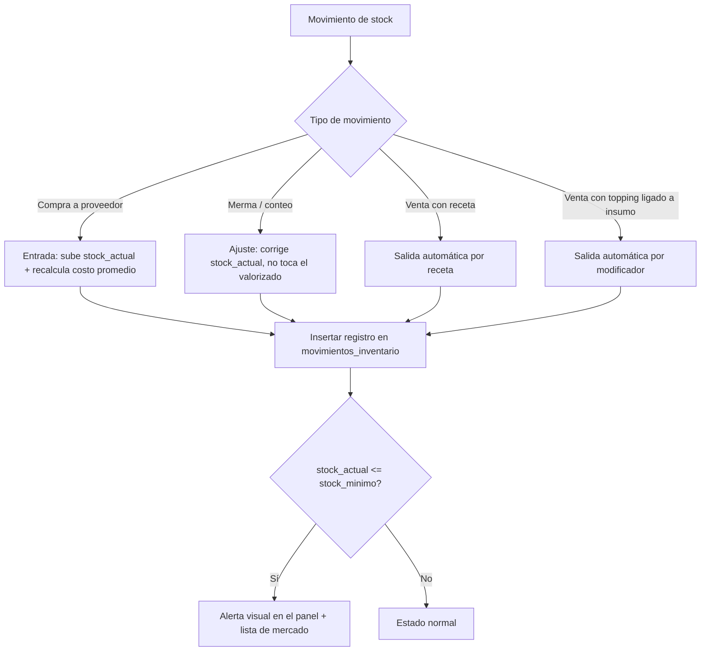

# 📦 Módulo 6: Inventario e Insumos

### 1. Descripción Funcional
Maneja el catálogo de materias primas y consumibles (alimentos, bebidas, envases). Controla el stock físico, umbrales mínimos de alerta, valorización (costo promedio ponderado) y la bitácora de auditoría de cada movimiento. Se integra con **Proveedores** (compras y facturas de proveedor) y descuenta stock automáticamente al vender productos con **receta** y toppings con **descuento de inventario** (ver módulos 7 y 12).

---

### 2. Componentes del Código
* **Controlador:** [InventarioController.js](file:///c:/laragon/www/Sistema-Restaurante-Node/app/Http/Controllers/Tenant/InventarioController.js)
* **Servicios:**
  * [InventarioService.js](file:///c:/laragon/www/Sistema-Restaurante-Node/services/Tenant/InventarioService.js) — movimientos, costo promedio, `descontarPorReceta`, `descontarPorModificadoresFactura`, valorización, lista de mercado.
  * [InsumoService.js](file:///c:/laragon/www/Sistema-Restaurante-Node/services/Tenant/InsumoService.js) — CRUD del catálogo, import desde Excel.
* **Repositorios:** [InsumoRepository.js](file:///c:/laragon/www/Sistema-Restaurante-Node/repositories/Tenant/InsumoRepository.js) · [MovimientoInventarioRepository.js](file:///c:/laragon/www/Sistema-Restaurante-Node/repositories/Tenant/MovimientoInventarioRepository.js)
* **Ruta:** `/inventario` · API bajo `/inventario/api/*`

---

### 3. Tablas de Base de Datos Relacionadas
* `insumos`: `stock_actual`, `stock_minimo`, `unidad_base` (g/ml/UND), `costo_promedio` (ponderado), `stock_valorizado`, `precio_compra` / `cantidad_compra`, `rendimiento_pct`, `categoria_id`, `proveedor_id`.
* `movimientos_inventario`: bitácora de cada cambio (`entrada`, `salida`, `ajuste`), cantidad, `costo_unitario`, referencia (ej. `factura_123`, `factura_123 (toppings)`, `Stock inicial`), proveedor.
* `proveedores` / `proveedor_facturas`: proveedor principal del insumo y facturas de compra registradas.

---

### 4. Diagrama del Proceso de Gestión de Stock

```mermaid
graph TD
    A["Movimiento de stock"] --> B{"Tipo de movimiento"}
    B -->|Compra a proveedor| C["Entrada: sube stock_actual + recalcula costo promedio"]
    B -->|Merma / conteo| D["Ajuste: corrige stock_actual, no toca el valorizado"]
    B -->|Venta con receta| E["Salida automática por receta"]
    B -->|Venta con topping ligado a insumo| F["Salida automática por modificador"]
    C & D & E & F --> G["Insertar registro en movimientos_inventario"]
    G --> H{"stock_actual <= stock_minimo?"}
    H -->|Sí| I["Alerta visual en el panel + lista de mercado"]
    H -->|No| J["Estado normal"]
```

---

### 5. Descuento por toppings/modificadores
Si un grupo de modificadores tiene `descuenta_inventario = 1` y sus opciones están enlazadas a un insumo, al **facturar** se ejecuta `InventarioService.descontarPorModificadoresFactura(tenantId, facturaId)`: lee `detalle_factura_modificadores`, acumula por insumo (`cantidad_insumo × cantidad de la línea`) y genera una salida por insumo. Si no hay stock suficiente, **avisa y permite negativo** (igual que el descuento por receta). Ver módulo 12.

---

### 6. Bugs conocidos (pendientes de arreglo)
1. **No deja eliminar un insumo recién creado con stock inicial:** el "Stock inicial" crea un `movimientos_inventario` con FK `ON DELETE RESTRICT` → el borrado se bloquea. Fix propuesto: en `InsumoService.delete`, si el insumo no está en `receta_ingredientes`, borrar sus movimientos y luego el insumo (transaccional).
2. **El modal de edición de insumo no permite corregir las existencias actuales** (solo el stock mínimo). Fix propuesto: campo "Existencias actuales" que registre un `ajuste` por la diferencia (conteo físico).
