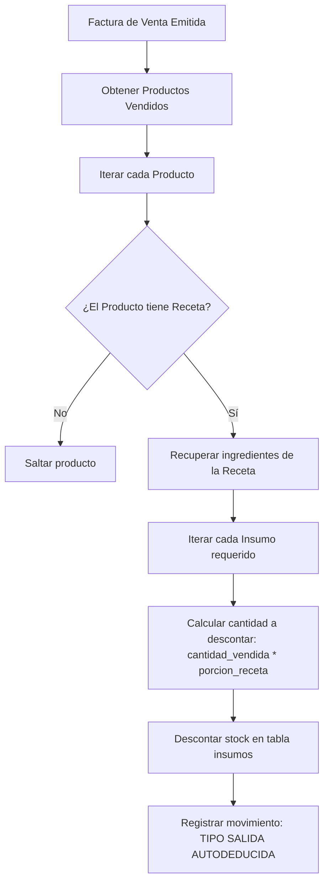

# 🍳 Módulo 7: Recetas y Costeo

### 1. Descripción Funcional
Permite estructurar las fichas técnicas (recetas) de los platos del menú para automatizar el control de inventario y realizar ingeniería de costos. Compara de forma inteligente el costo total de insumos, merma tolerable y costos fijos por porción contra el precio de venta sugerido, asegurando márgenes de rentabilidad saludables.

---

### 2. Componentes del Código
* **Controladores:**
  * [RecetasController.js](file:///c:/laragon/www/Sistema-Restaurante-Node/app/Http/Controllers/Tenant/RecetasController.js)
  * [CosteoController.js](file:///c:/laragon/www/Sistema-Restaurante-Node/app/Http/Controllers/Tenant/CosteoController.js)
* **Servicios:**
  * [RecetaService.js](file:///c:/laragon/www/Sistema-Restaurante-Node/services/Tenant/RecetaService.js)
  * [CosteoService.js](file:///c:/laragon/www/Sistema-Restaurante-Node/services/Tenant/CosteoService.js)
* **Repositorios:**
  * [RecetaRepository.js](file:///c:/laragon/www/Sistema-Restaurante-Node/repositories/Tenant/RecetaRepository.js)
  * [ConfiguracionCosteoRepository.js](file:///c:/laragon/www/Sistema-Restaurante-Node/repositories/Tenant/ConfiguracionCosteoRepository.js)
  * [CostosFijosRepository.js](file:///c:/laragon/www/Sistema-Restaurante-Node/repositories/Tenant/CostosFijosRepository.js)

---

### 3. Tablas de Base de Datos Relacionadas
* `recetas`: Cabecera de la receta asociada a un producto de venta.
* `receta_detalles`: Especificación de ingredientes (`insumo_id`), cantidad neta consumida por plato y merma tolerable.
* `costos_fijos`: Registros de gastos operativos fijos (alquiler, servicios públicos, nóminas).
* `configuracion_costeo`: Margen de ganancia ideal por tipo o categoría de producto.

---

### 4. Diagrama de Deducción Automática por Venta

