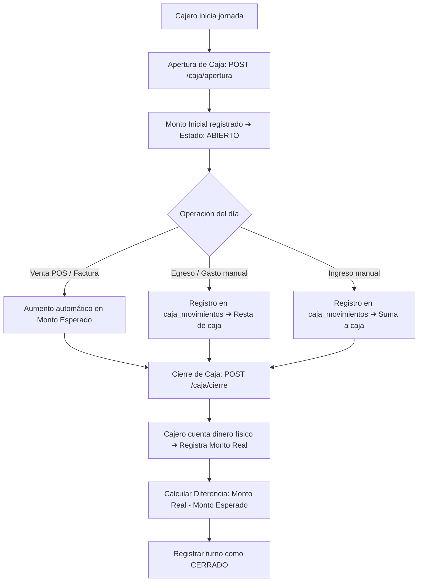

# 💵 Módulo 8: Caja Diaria y Turnos

### 1. Descripción Funcional
Audita y controla el flujo de dinero físico en la sucursal. Los cajeros deben reportar el dinero de apertura del turno, registrar salidas manuales (gastos imprevistos, pago a proveedores de contado) o ingresos manuales, y registrar el conteo físico de cierre para conciliar faltantes o sobrantes de caja.

---

### 2. Componentes del Código
* **Controlador:** [CajaController.js](file:///c:/laragon/www/Sistema-Restaurante-Node/app/Http/Controllers/Tenant/CajaController.js)
* **Servicio:** [CajaService.js](file:///c:/laragon/www/Sistema-Restaurante-Node/services/Tenant/CajaService.js)
* **Repositorio:** [CajaRepository.js](file:///c:/laragon/www/Sistema-Restaurante-Node/repositories/Tenant/CajaRepository.js)

---

### 3. Tablas de Base de Datos Relacionadas
* `caja_turnos`: Bitácora de turnos (usuario de apertura y cierre, fechas, saldo inicial registrado, monto teórico esperado, monto real contado, diferencia final y estado: `abierto` / `cerrado`).
* `caja_movimientos`: Depósito y extracción manual de fondos de caja no vinculados a facturación.

---

### 4. Diagrama del Ciclo de Vida del Turno de Caja

