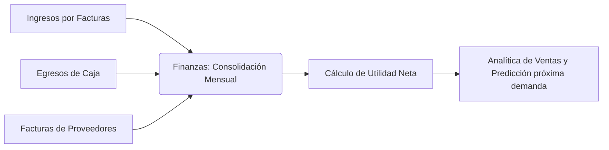

# 📈 Módulo 9: Finanzas y Analítica

### 1. Descripción Funcional
Muestra reportes consolidados del rendimiento del negocio cruzando ventas netas con gastos variables y costos fijos. Contiene algoritmos estadísticos básicos para predecir volúmenes de ventas de los próximos periodos en base a patrones históricos.

---

### 2. Componentes del Código
* **Controladores:**
  * [FinanzasController.js](file:///c:/laragon/www/Sistema-Restaurante-Node/app/Http/Controllers/Tenant/FinanzasController.js)
  * [AnaliticaController.js](file:///c:/laragon/www/Sistema-Restaurante-Node/app/Http/Controllers/Tenant/AnaliticaController.js)
* **Servicios:**
  * [FinanzasService.js](file:///c:/laragon/www/Sistema-Restaurante-Node/services/Tenant/FinanzasService.js)
  * [AnaliticaService.js](file:///c:/laragon/www/Sistema-Restaurante-Node/services/Tenant/AnaliticaService.js)
* **Repositorios:** [FinanzasRepository.js](file:///c:/laragon/www/Sistema-Restaurante-Node/repositories/Tenant/FinanzasRepository.js)

---

### 3. Tablas de Base de Datos Relacionadas
* `facturas`: Reporta las ventas netas.
* `caja_movimientos`: Aporta el detalle de egresos/gastos menores registrados.
* `costos_fijos`: Costos operacionales del local.
* `proveedor_facturas`: Compras y egresos a proveedores de insumos.

---

### 4. Diagrama del Consolidado Financiero

