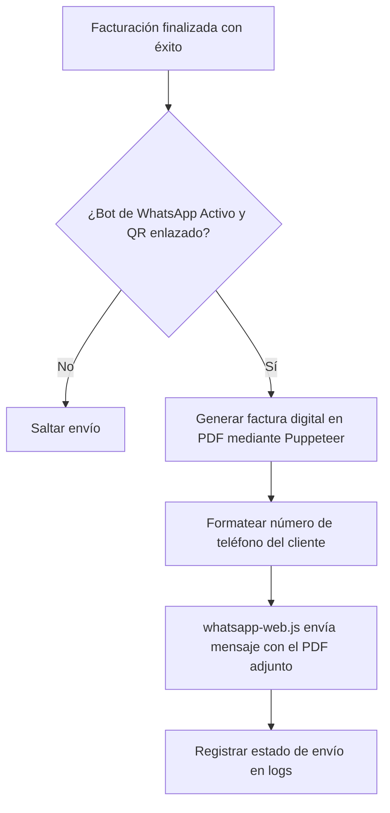

# 🤖 Módulo 10: Integración de WhatsApp Bot

### 1. Descripción Funcional
Envía de forma automatizada comprobantes digitales de consumo a los clientes. Al facturar una compra, este servicio genera un archivo PDF y simula un cliente web en segundo plano para enviar el archivo al número de WhatsApp del cliente registrado.

---

### 2. Componentes del Código
* **Controlador:** [WhatsAppController.js](file:///c:/laragon/www/Sistema-Restaurante-Node/app/Http/Controllers/Tenant/WhatsAppController.js)
* **Servicio:** [WhatsAppService.js](file:///c:/laragon/www/Sistema-Restaurante-Node/services/Tenant/WhatsAppService.js)
* **Integración externa:** `whatsapp-web.js`

---

### 3. Tablas de Base de Datos Relacionadas
* `configuracion_impresion`: Almacena si el bot está encendido/apagado y credenciales o estado del cliente web.
* `clientes`: Mantiene los números de teléfono móviles de destino en formato internacional.

---

### 4. Diagrama del Flujo de Notificaciones

