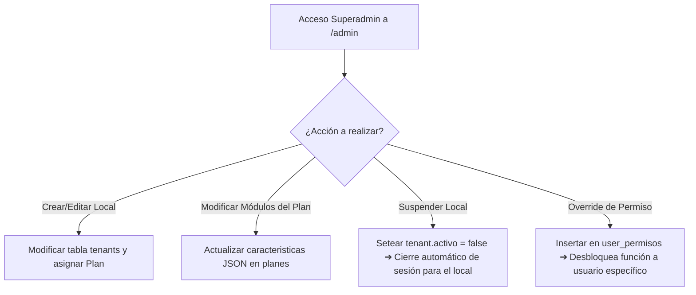

# 🏢 Módulo 11: Panel de Superadmin

### 1. Descripción Funcional
Permite a los administradores generales de la plataforma SaaS gestionar los restaurantes registrados (tenants), crear y modificar los planes de precios disponibles, activar o suspender cuentas de locales y dar excepciones o overrides de permisos específicos por usuario.

---

### 2. Componentes del Código
* **Controladores:**
  * [TenantsController.js](file:///c:/laragon/www/Sistema-Restaurante-Node/app/Http/Controllers/Admin/TenantsController.js)
  * [PlanesController.js](file:///c:/laragon/www/Sistema-Restaurante-Node/app/Http/Controllers/Admin/PlanesController.js)
  * [PermisosController.js](file:///c:/laragon/www/Sistema-Restaurante-Node/app/Http/Controllers/Admin/PermisosController.js)
* **Repositorios:** [TenantRepository.js](file:///c:/laragon/www/Sistema-Restaurante-Node/repositories/Admin/TenantRepository.js)
* **Ruta de Acceso:** `/admin/*`

---

### 3. Tablas de Base de Datos Relacionadas
* `tenants`: Lista de locales registrados, estado de activación, plan contratado y subdominio/slug.
* `planes`: Catálogo de planes (nombre, características en JSON y precios).
* `user_permisos` y `rol_permisos` (para asignación directa).

---

### 4. Diagrama de Flujo de Operaciones Globales

