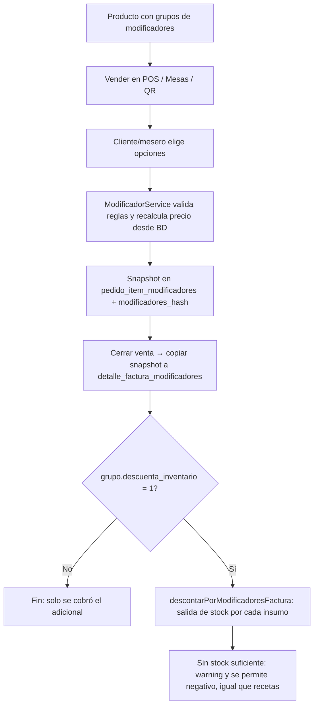

# 🧀 Módulo 12: Modificadores / Toppings

### 1. Descripción Funcional
Permite a cada restaurante definir **grupos de opciones** (ej. *"Elige tu salsa"*, *"Toppings extra"*, *"Nivel de picante"*) y asignarlos a productos. Al vender el producto en **POS**, **Mesas** o el **Menú QR**, el mesero o el cliente elige las opciones; el precio adicional y el snapshot de lo elegido se guardan en la línea de venta.

Opcionalmente, un grupo puede **descontar inventario**: cada opción se enlaza a un insumo y una cantidad, y al facturar se genera la salida de stock correspondiente (además del descuento por receta del producto).

---

### 2. Componentes del Código
* **Controlador:** [ModificadoresController.js](file:///c:/laragon/www/Sistema-Restaurante-Node/app/Http/Controllers/Tenant/ModificadoresController.js)
* **Servicio:** [ModificadorService.js](file:///c:/laragon/www/Sistema-Restaurante-Node/services/Tenant/ModificadorService.js) — valida reglas (obligatorio, mín/máx), recalcula el precio adicional desde la BD (nunca confía en el frontend) y produce el snapshot a persistir.
* **Repositorio:** [ModificadorRepository.js](file:///c:/laragon/www/Sistema-Restaurante-Node/repositories/Tenant/ModificadorRepository.js)
* **Descuento de inventario:** `InventarioService.descontarPorModificadoresFactura(tenantId, facturaId)` — se llama tras crear la factura en `FacturaService` (POS/directo) y en `FacturarPedidoService` (Mesas/QR).
* **Rutas:** `/modificadores` (vista) · `GET|POST|PUT|DELETE /modificadores/api/grupos` · `GET|PUT /modificadores/api/productos/:productoId/grupos`
* **Permisos:** `modificadores.ver`, `modificadores.editar` (admin/superadmin por defecto).

---

### 3. Tablas de Base de Datos Relacionadas
* `grupos_modificadores`: nombre, `tipo_seleccion` (`unica`/`multiple`), `obligatorio`, `minimo_selecciones`, `maximo_selecciones`, **`descuenta_inventario`** (flag opt-in).
* `opciones_modificador`: opciones de un grupo con `precio_adicional` y, si el grupo descuenta inventario, `insumo_id` + `cantidad_insumo` + `unidad_insumo`.
* `producto_modificador_grupo`: asignación N:M de grupos a productos, con orden.
* `pedido_item_modificadores`: snapshot de las opciones elegidas en cada línea de pedido (nombre, precio y — si aplica — insumo/cantidad), más `pedido_items.modificadores_hash` para que Cocina agrupe correctamente ítems iguales con toppings distintos.
* `detalle_factura_modificadores`: mismo snapshot copiado a la factura al cerrar la venta. **Fuente del descuento de inventario por toppings.**

> Las tablas `*_modificadores` guardan un **snapshot** (no FK a `opciones_modificador` para el detalle histórico) para que el histórico de venta y de consumo no cambie si luego se edita o borra la opción del catálogo.

---

### 4. Diagrama del Flujo (venta + descuento de inventario)

---

### 5. Notas de implementación
* El enlace opción → insumo **solo cuenta si el grupo tiene `descuenta_inventario = 1`** (opt-in real): una opción con `insumo_id` viejo en un grupo sin el flag no mueve stock.
* La cantidad del insumo se ingresa en la **unidad base** del insumo (g / ml / UND); la conversión la resuelve `unidadesCosteo.convertirABase`.
* En el editor de grupos (`/modificadores`) hay un checkbox *"Descontar del inventario al vender"* que muestra/oculta los campos de insumo por opción. Sin marcarlo, el módulo funciona como antes (solo nombre + precio).

### 6. Pendiente (2ª vuelta)
* "Toppings incluidos por defecto" en un producto (vienen con el plato, descuentan sin re-escribirlos como receta).
* Descuento cuando se paga un **ítem individual** (`PagarItemIndividualService` no copia los modificadores).
* Chequeo de stock de toppings *antes* de vender (hoy solo se avisa).
