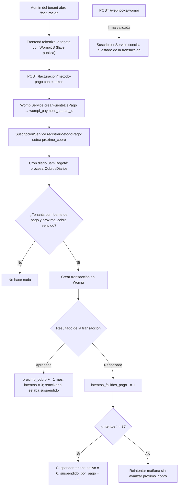

# 💳 Módulo 13: Suscripción y Cobro Automático (Wompi)

### 1. Descripción Funcional
Automatiza el **cobro mensual de la suscripción de cada restaurante (tenant)** a la plataforma GastroFlow mediante la pasarela **Wompi**. El administrador de cada local registra una tarjeta (tokenizada en el navegador, nunca toca el servidor), y un cron diario cobra el período correspondiente. Tras 3 intentos fallidos consecutivos el tenant se suspende automáticamente; un cobro exitoso posterior lo reactiva.

> ⚠️ No confundir con `facturas` / `detalle_factura`, que son las **ventas del restaurante a sus clientes**. Este módulo es la facturación **SaaS** (la plataforma cobrándole al restaurante).

---

### 2. Componentes del Código
* **Vista/Controlador del tenant:** [FacturacionController.js](file:///c:/laragon/www/Sistema-Restaurante-Node/app/Http/Controllers/Tenant/FacturacionController.js) — estado de la suscripción, historial de cobros, alta/actualización de tarjeta, "cobrar ahora".
* **Lógica de negocio:** [SuscripcionService.js](file:///c:/laragon/www/Sistema-Restaurante-Node/services/Admin/SuscripcionService.js) — cálculo del monto (vía `AddonService`), política de reintento/suspensión, reactivación, reconciliación de transacciones pendientes.
* **Cliente HTTP puro de Wompi:** [WompiService.js](file:///c:/laragon/www/Sistema-Restaurante-Node/services/Shared/WompiService.js) — `sandbox`/`production` según `WOMPI_ENV`; fuentes de pago, transacciones, y verificación de firma de webhooks.
* **Webhook:** [WompiWebhookController.js](file:///c:/laragon/www/Sistema-Restaurante-Node/app/Http/Controllers/Webhooks/WompiWebhookController.js) — `POST /webhooks/wompi`, público, autenticado por **firma** (no por sesión).
* **Cron:** en `config/bootstrap.js`, `0 13 * * *` (8:00 am Bogotá) → `reconciliarPendientes()` + `procesarCobrosDiarios()`.
* **Rutas:** `/facturacion` · `POST /facturacion/metodo-pago` · `POST /facturacion/cobrar-ahora` · `POST /webhooks/wompi`
* **Permisos:** `facturacion.ver`, `facturacion.editar`.
* **Variables de entorno:** `WOMPI_ENV`, `WOMPI_PUBLIC_KEY`, `WOMPI_PRIVATE_KEY`, `WOMPI_EVENTS_SECRET`, `WOMPI_INTEGRITY_SECRET`.

---

### 3. Tablas de Base de Datos Relacionadas
* `tenants` (columnas añadidas): `wompi_payment_source_id`, `proximo_cobro`, `intentos_fallidos_pago`, `suspendido_por_pago`, `ultimo_intento_cobro_at`.
* `suscripcion_pagos`: historial de intentos de cobro (`estado` `pendiente`/`exitoso`/`fallido`, `wompi_transaction_id`, `wompi_reference` único, período, `respuesta_raw` JSON).

---

### 4. Diagrama del Flujo de Cobro

---

### 5. Regla de seguridad
El cron **nunca** toca un tenant sin `wompi_payment_source_id`. Los locales existentes (o cualquiera que no registre tarjeta) siguen en **cobro 100% manual**. Si las variables `WOMPI_*` no están configuradas, el arranque del servidor no se bloquea; solo fallan (con error claro) las operaciones que llaman a Wompi.
